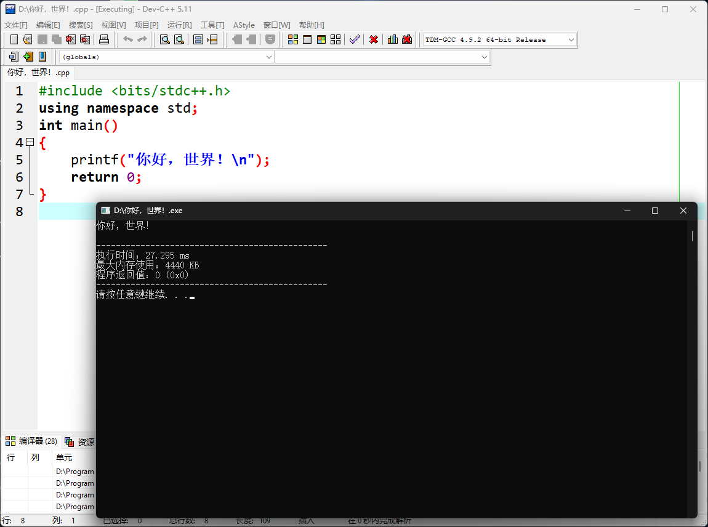

# ConsolePauser 控制台暂停程序

A Chinese version replacement for ConsolePauser in Dev-C++. Dev-C++中ConsolePauser的可替代中文版  

*Windows only 只能在Windows系统中使用！*  

可显示以下内容  
> -----------------------------------------------  
> 执行时间：\* ms  
> 最大内存使用：\* KB  
> 程序返回值：0 (0x0)  
> -----------------------------------------------  
> 请按任意键继续. . .  

## 使用截图
  

## 使用方法
1. 下载安装 Dev-C++，进入安装路径（已安装完的可在 Dev-C++ 快捷方式上右键-打开文件的所在位置）  
2. [点我]()下载 ConsolePauser.exe 替换安装目录中原本的 ConsolePauser.exe  
  
# 编译方法
使用MinGW编译 ConsolePauser.c  
参考命令：gcc ConsolePauser.c -lpsapi -m32 -s -o ConsolePauser.exe